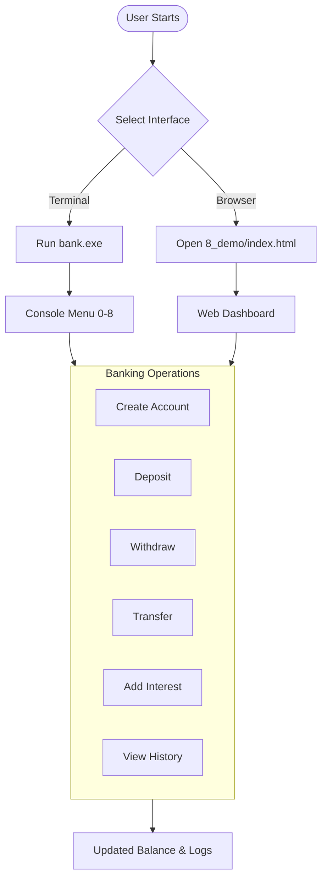

# 🏦 Bank Account Management System

Welcome to the **Bank Account Management System** — a hybrid Banking Software Solution providing both a robust, object-oriented **C++ Console Application** and an interactive, modern **Web Dashboard** (HTML5/CSS3/JavaScript).

---

## 📌 Table of Contents
1. [🎯 Project Purpose](#-project-purpose)
2. [✨ Key Features](#-key-features)
3. [🛠️ Tech Stack](#️-tech-stack)
4. [📂 Directory Structure](#-directory-structure)
5. [🔄 System Workflow](#-system-workflow)
6. [🚀 How to Run](#-how-to-run)
7. [📖 How to Use](#-how-to-use)
8. [👨‍💻 Author](#-author)

---

## 🎯 Project Purpose

- **Educational Showcase:** Demonstrates core OOP concepts in C++ — Inheritance, Polymorphism, Encapsulation.
- **Web GUI:** A visual HTML/JS interface so anyone can simulate banking operations in a browser without compiling anything.

---

## ✨ Key Features

### 💳 Account Types
- **Savings Account** — Has an Interest Rate (%). Use option `8` / Add Interest button to apply interest.
- **Current Account** — Has an Overdraft Limit ($). Allows withdrawal beyond balance up to the overdraft ceiling.

### ⚙️ Banking Operations
- ➕ Create Savings or Current Account
- 💵 Deposit funds
- 🏧 Withdraw (with overdraft support for Current Accounts)
- 🔄 Transfer between accounts
- 📈 Add Interest (Savings only)
- 📜 Transaction History per account
- 📊 Live Accounts Ledger (Web UI)

---

## 🛠️ Tech Stack

### C++ Console App
- `#include<bits/stdc++.h>` + `using namespace std`
- OOP: Inheritance, Polymorphism, virtual functions
- Basic arrays and raw pointers — no complex STL
- Compiler: `g++` (MinGW-w64)

### Web Dashboard
- **HTML5** + **CSS3** + **Vanilla JavaScript**
- No server needed — open directly in browser
- `Map()` for account state management

---

## 📂 Directory Structure

```text
BankProject/
├── 1_Account.h              # Base Account class header
├── 2_Account.cpp            # Base Account class implementation
├── 3_SavingsAccount.h       # SavingsAccount header
├── 4_SavingsAccount.cpp     # SavingsAccount implementation
├── 5_CurrentAccount.h       # CurrentAccount header
├── 6_CurrentAccount.cpp     # CurrentAccount implementation
├── 7_main.cpp               # Main menu & program entry point
├── build.bat                # Windows build script (runs g++)
├── 8_demo/                  # Web Dashboard (HTML/CSS/JS)
│   ├── index.html
│   ├── style.css
│   ├── app.js
│   └── bank.png
├── .gitignore
└── README.md
```

---

## 🔄 System Workflow



---

## 🚀 How to Run

### Option 1: C++ Console Application

**Requirement:** `g++` compiler installed and added to PATH.

```powershell
.\build.bat
.\bank.exe
```

**Manual compile:**
```bash
g++ 2_Account.cpp 4_SavingsAccount.cpp 6_CurrentAccount.cpp 7_main.cpp -o bank.exe
.\bank.exe
```

---

### Option 2: Web Dashboard

No installation needed!

1. Open the `8_demo/` folder
2. Double-click `index.html`
3. Opens directly in any browser — Chrome, Edge, Firefox

---

## 📖 How to Use

### Creating an Account
- **CLI:** Press `1` (Savings) or `2` (Current) → enter number, name, balance, interest/overdraft
- **Web:** Fill the form on the left → click **Create Account**

### Deposit
- CLI: Press `3` → enter account number → enter amount
- Web: Select account → enter amount → click **Deposit**

### Withdraw
- CLI: Press `4` → enter account number → enter amount
- Web: Select account → enter amount → click **Withdraw**
- Current accounts can withdraw up to `balance + overdraftLimit`

### Transfer
- CLI: Press `5` → enter sender number → receiver number → amount
- Web: Select Source & Target accounts → enter amount → click **Transfer**

### Add Interest
- CLI: Press `8` → enter Savings account number
- Web: Select Savings account → click **Add Interest**

### View Details / History
- CLI: Press `6` for details, `7` for transaction history
- Web: Click **Show Details** or **History Log**

---

## 👨‍💻 Author

Designed and developed by:

### **SHOEB RAZA**
* **GitHub:** [@razashoeb840](https://github.com/razashoeb840)
* **Repository:** [CPP_Bank_Account_Management_System_SHOEB_RAZA](https://github.com/razashoeb840/CPP_Bank_Account_Management_System_SHOEB_RAZA.git)

---
*Thank you for exploring the Bank Account Management System!*
