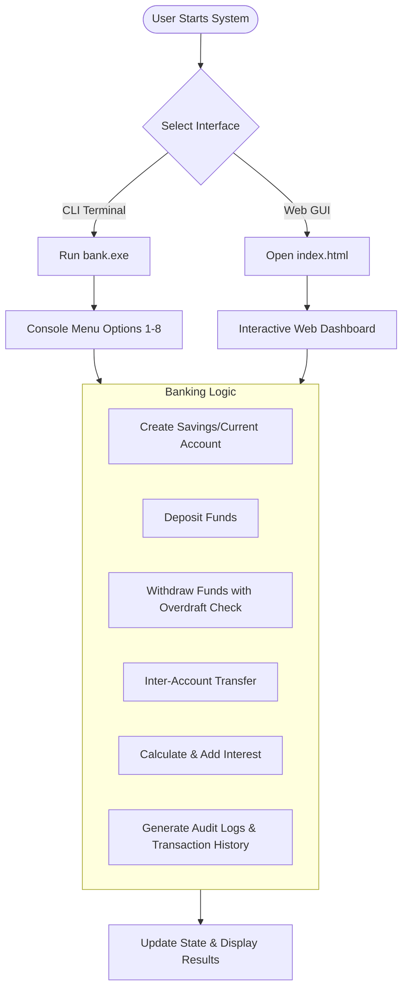

# 🏦 Bank Account Management System

Welcome to the **Bank Account Management System** — a hybrid Banking Software Solution providing both a robust, object-oriented **C++ Console Application Core** and an interactive, modern **Web Dashboard Interface** (HTML5/CSS3/JavaScript).

Designed for speed, reliability, and ease of use, this project demonstrates core banking operations such as account creation, deposit, withdrawal with overdraft management, inter-account funds transfer, interest compounding, and complete transaction history logging.

---

## 📌 Table of Contents
1. [🎯 Project Purpose](#-project-purpose)
2. [✨ Key Features](#-key-features)
3. [🛠️ Tech Stack & Architecture](#️-tech-stack--architecture)
4. [📂 Directory Structure](#-directory-structure)
5. [🔄 System Workflow](#-system-workflow)
6. [🚀 How to Run](#-how-to-run)
   - [Option 1: C++ Console Application](#option-1-c-console-application)
   - [Option 2: Web Dashboard Interface](#option-2-web-dashboard-interface)
7. [📖 How to Use](#-how-to-use)
   - [1. Creating an Account](#1-creating-an-account)
   - [2. Deposit Funds](#2-deposit-funds)
   - [3. Withdraw Funds](#3-withdraw-funds)
   - [4. Transfer Funds](#4-transfer-funds)
   - [5. Add Interest](#5-add-interest)
   - [6. Viewing Details & Transaction History](#6-viewing-details--transaction-history)
8. [👨‍💻 Author & Credits](#-author--credits)

---

## 🎯 Project Purpose

The primary goal of this project is to simulate real-world banking operations through a modular architecture:
- **Educational & Technical Showcase:** Demonstrating advanced Object-Oriented Programming (OOP) concepts in C++ (Inheritance, Polymorphism, Dynamic Dispatch, Encapsulation, Smart Memory Management).
- **User-Friendly Access:** Providing a high-performance, dark-themed Web GUI so non-technical users can perform visual banking simulations in real-time.

---

## ✨ Key Features

### 💳 Account Types
- **Savings Account (`SavingsAccount`)**:
  - Requires an initial deposit and an **Interest Rate (%)**.
  - Built-in **Add Interest** option that calculates and adds earned interest directly to the account balance.
- **Current Account (`CurrentAccount`)**:
  - Tailored for business/daily transactions with an **Overdraft Limit ($)**.
  - Allows withdrawals exceeding the active balance up to the configured overdraft ceiling (`balance + overdraftLimit`).

### ⚙️ Core Banking Operations
- ➕ **Account Creation**: Prevent duplicate account numbers; dynamic form fields based on account type.
- 💵 **Deposit**: Add money into any valid account with positive validation.
- 🏧 **Withdraw**: Withdraw money with balance checks (and overdraft protection for Current Accounts).
- 🔄 **Funds Transfer**: Move money safely from one sender account to a receiver account in a single operation.
- 📈 **Interest Compounding**: Apply percentage interest to Savings accounts dynamically.
- 📜 **Transaction History**: Audit log tracking every deposit, withdrawal, transfer, and interest application.
- 📊 **Real-Time Accounts Ledger**: Interactive data table displaying all registered accounts, balances, types, and special parameters.

---

## 🛠️ Tech Stack & Architecture

### 1. C++ Backend / Core Engine
- **Language Standard**: C++14 / C++17
- **OOP Principles Used**:
  - **Inheritance**: `Account` (Base class) $\rightarrow$ `SavingsAccount` & `CurrentAccount` (Derived classes).
  - **Polymorphism**: Virtual methods for `deposit()`, `withdraw()`, `showDetails()`, `getAccountType()`.
  - **Encapsulation**: Private/Protected members (`balance`, `accountNumber`, `name`, `transactionHistory`).
  - **Smart Pointers**: `std::vector<std::unique_ptr<Account>>` for automatic memory management.
  - **RTTI & Casting**: `dynamic_cast<SavingsAccount*>` for type-safe interest additions.
- **Compiler**: `g++` (MinGW-w64).

### 2. Web GUI Dashboard
- **HTML5**: Semantic web structure, accessible forms, font icons (FontAwesome 6.4.0), Google Fonts (Inter & JetBrains Mono).
- **CSS3**: Custom design system featuring CSS variables, dark-mode cyber aesthetic, glowing indicators, glassmorphism containers, responsive CSS grid/flexbox layouts.
- **JavaScript (ES6+)**: Pure Vanilla JS, using `Map()` for fast $O(1)$ account lookup state management, real-time DOM rendering, and instant feedback.

---

## 📂 Directory Structure

```text
BankProject/
├── Account.h             # Base Account class header
├── Account.cpp           # Base Account class implementation
├── SavingsAccount.h      # SavingsAccount class header (Interest rate feature)
├── SavingsAccount.cpp    # SavingsAccount implementation
├── CurrentAccount.h      # CurrentAccount class header (Overdraft limit feature)
├── CurrentAccount.cpp    # CurrentAccount implementation
├── main.cpp              # C++ CLI Menu entry point
├── build.bat             # Windows script to build bank.exe via g++
├── index.html            # Web Dashboard user interface
├── style.css             # Web Dashboard styling system
├── app.js                # Client-side JavaScript banking engine
├── bank.png              # Project logo / branding asset
├── .gitignore            # Git ignore rules for build artifacts
└── README.md             # Project documentation
```

---

## 🔄 System Workflow



---

## 🚀 How to Run

### Option 1: C++ Console Application

#### Prerequisites:
- A C++ Compiler (such as `g++` from MinGW-w64 or GCC) installed and added to your system `PATH`.

#### Quick Build & Run (Windows):
1. Open Command Prompt (`cmd`) or PowerShell inside the project directory.
2. Run the build batch file:
   ```cmd
   build.bat
   ```
3. Run the compiled executable:
   ```cmd
   bank.exe
   ```

#### Manual Compilation Command:
```bash
g++ main.cpp Account.cpp SavingsAccount.cpp CurrentAccount.cpp -o bank.exe
./bank.exe
```

---

### Option 2: Web Dashboard Interface

No installation or build tools required!

1. Simply double-click `index.html` or open it in any modern web browser (Google Chrome, Microsoft Edge, Mozilla Firefox, Brave, Safari).
2. Start managing accounts directly in the visual UI.

---

## 📖 How to Use

### 1. Creating an Account
- **Web UI**: Navigate to the **"Open New Account"** card. Select **Savings** or **Current**. Enter the Account Number, Holder Name, Opening Balance, and Interest Rate (%) or Overdraft Limit ($). Click **Create Account**.
- **CLI**: Select option `1` for Savings Account or `2` for Current Account from the main menu and follow the prompts.

### 2. Deposit Funds
- Select your target account from the drop-down menu (or enter the account number in CLI).
- Enter the deposit amount (or click quick presets `$10`, `$50`, `$100`, `$500` in Web UI).
- Click **Deposit**. The updated balance and log will appear immediately.

### 3. Withdraw Funds
- Select the account number and enter the withdrawal amount.
- For **Current Accounts**, you can withdraw beyond $0 up to your approved Overdraft Limit.
- If the amount exceeds available limits, the transaction is declined with a notification.

### 4. Transfer Funds
- Select the **Active Account** (Sender) and **Target Account** (Receiver).
- Enter the transfer amount and click **Transfer**. Funds will be debited from the sender and credited to the receiver automatically.

### 5. Add Interest
- Select a **Savings Account**.
- Click **Add Interest** (or Option `8` in CLI). Interest will be calculated based on the account's interest rate and added to the balance.

### 6. Viewing Details & Transaction History
- **Show Details**: Displays account holder information, account type, balance, and interest/overdraft limits.
- **Transaction History**: Displays a sequential audit log of all completed transactions for that specific account.
- **Accounts Ledger**: The table at the bottom of the Web UI continuously displays all active accounts.

---

## 👨‍💻 Author & Credits

Designed, developed, and maintained with ❤️ by:

### **SHOEB RAZA**
* **GitHub:** [@razashoeb840](https://github.com/razashoeb840)
* **Project Repository:** [CPP_Bank_Account_Management_System_SHOEB_RAZA](https://github.com/razashoeb840/CPP_Bank_Account_Management_System_SHOEB_RAZA.git)

---
*Thank you for exploring the Bank Account Management System!*
